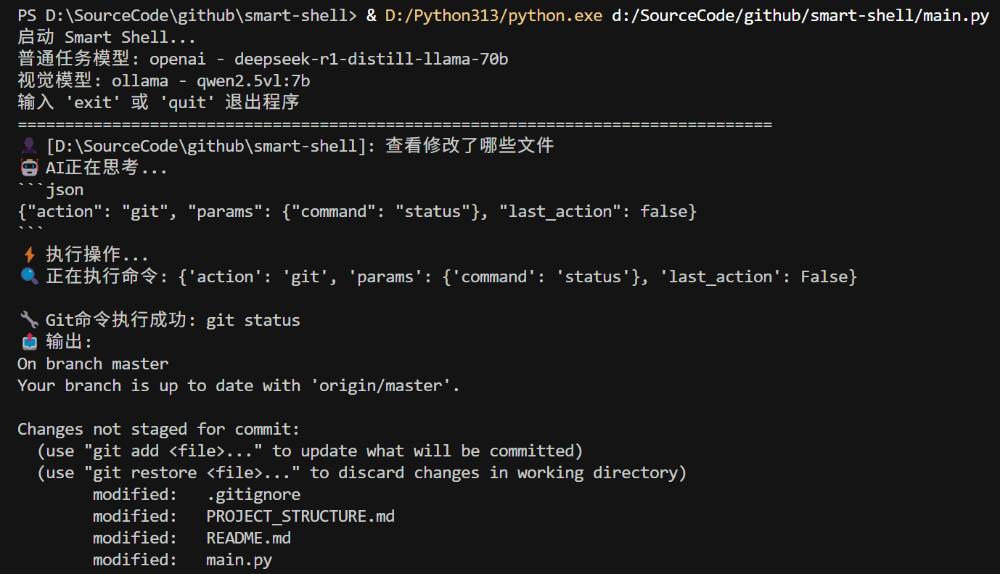

# Smart Shell

一个基于大语言模型的智能Shell，支持自然语言指令和Tab键自动补全功能。

## ✨ 主要特性

- 🤖 **AI驱动**: 使用大语言模型理解自然语言指令
- 📁 **智能文件管理**: 支持文件浏览、复制、移动、删除等操作
- 📝 **双文件创建语义**: `script` 用于本会话任务/临时脚本（config 侧 workspace，随后 `shell` 执行）；`text_file` **仅当**用户明确要在当前目录**长期保留**某文件时使用，**不要**用 `text_file` 写「只为跑完任务」的临时脚本
- 🎬 **媒体处理**: 支持视频、音频文件格式转换
- 🖼️ **图片解读**: 使用AI分析图片中的文字、物体、场景等信息
- ⌨️ **Tab补全**: 智能文件名和路径自动补全
- 📝 **历史记录**: 支持命令历史记录和导航
- 🔄 **跨平台**: 支持Windows、Linux、macOS
- 🎯 **统一模型配置**: 使用 `model_providers` 管理多模型提供方，默认选择第一个 provider 的第一个模型
- 📎 **Agent Skills**: 在 `config.jsonc` 所在目录的 `skills/` 下按 [Anthropic Agent Skills](https://github.com/anthropics/skills/blob/main/README.md) 放置 `SKILL.md`，启动时加载并注入系统提示（架构原则见 **[docs/skill-architecture.md](docs/skill-architecture.md)**，便于在其他 AI 编程工具中复用）

## 🚀 快速开始

### 环境要求

- Python 3.8+
- 网络连接（用于AI模型调用）

### 安装依赖

```bash
pip install -r requirements.txt
```

### 运行程序

```bash
python src/main.py
```

## ⌨️ Tab键自动补全功能

### Windows版本
- 使用 `prompt_toolkit` 库实现稳定的Tab补全
- 支持文件名和路径智能补全
- 支持历史记录导航（上下箭头键）
- 支持光标移动（左右箭头键）
- 无显示问题，体验流畅

### Unix/Linux/macOS版本
- 使用 `readline` 模块实现Tab补全
- 原生命令行体验

### 使用方法

1. **文件名补全**: 输入文件名开头部分，按Tab键自动补全
2. **路径补全**: 支持相对路径和绝对路径的智能补全
3. **多匹配处理**: 多个匹配项时显示选项列表
4. **历史导航**: 使用上下箭头键浏览历史命令
5. **光标控制**: 使用左右箭头键在输入中移动光标

## 🤖 AI功能

#### 执行策略（execution_policy）

- 在 `.smartshell/config.jsonc` 中使用 `execution_policy`，可选值：
  - `confirmation`：所有需确认操作都询问 y/n
  - `moderate`：对需确认操作先做安全性判定，安全则自动执行
  - `unlimited`：不做检测与确认，直接执行
- 使用 `/execution-policy <unlimited|moderate|confirmation>` 切换策略。
- 本会话内通过内置 `script` 命令创建的脚本，若随后用 `shell` 以该文件为主命令执行且**退出码为 0**，程序会尝试**自动删除**该脚本（避免临时文件残留）。若你希望长期保留脚本，请改用 `text_file` 在当前工作目录创建文件。

#### 确认提示中的 Always（a）与 `confirm_allowlist.json`

在**未开启自由模式**、且仍出现交互确认时，仅对 **`shell`（执行系统命令 / 通过命令行运行脚本）** 在提示中提供 **`a` 或 `always`**：表示**仅将当前这一条**记入免确认列表（`shell_script_paths` / `shell_exe_tokens`；不是全局放行所有命令）。**`script`（workspace 落盘）与 `text_file`（当前目录写文件）仅 y/n**，不提供 `a`。**例外**：`shell` 执行的是**本会话内**由 `script` 命令刚写入的临时脚本（尚未成功执行后自动删除的路径）时，确认提示**只有 y/n**，不提供 `a`，避免把短命临时脚本记入免确认列表。

- **配置文件**：与 `config.jsonc` 同目录下的 **`confirm_allowlist.json`**（`version` 为 2），包含：
  - `shell_script_paths`：由 shell 解析出的**脚本文件绝对路径**（忽略参数；同一 `.py` / `.ps1` 等仅记一条）。
  - `shell_exe_tokens`：无脚本文件时的**可执行标识**（如 `git`、`dir`，或某 `.exe` 的解析路径；忽略后续参数）。
  - `script_basenames`：历史遗留字段；若列表中仍有条目，同名 `script` 落盘可免确认。新交互下 `script`/`text_file` 不再通过 `a` 写入此项。
  - 若仍存在旧版 `shell_commands`（整行命令），启动时会读出并**折算**为上述字段，下次保存会写入 v2。
- **`/always_confirm reset`** 会删除该文件并恢复每次询问。

#### Agent Skills

与 [anthropics/skills](https://github.com/anthropics/skills/blob/main/README.md) 约定一致：在 **`config.jsonc` 所在目录** 下创建 `skills/` 子目录，每个技能一个文件夹，内含 **`SKILL.md`**（YAML frontmatter 至少包含 `name`、`description`，下方为 Markdown 正文）。

- **内建技能来源说明**：项目内建的部分 skills 基于 Anthropic 开源 skills 进行引入并按本项目场景做了适配修改，来源见 [anthropics/skills（skills 目录）](https://github.com/anthropics/skills/tree/main/skills)；另外也集成了一些其他开源 skills，此处不逐一列出。
- **路径示例**：使用项目内配置时为 `.smartshell/skills/my-skill/SKILL.md`；使用用户主目录配置时为 `~/.smartshell/skills/...`。
- **随包脚本**：技能目录下可放置 `scripts/*.py` 等文件；正文中的相对路径相对于该技能文件夹。系统提示会注入 **Skill bundle root** 绝对路径，并列出检测到的脚本，便于在 `shell` 中用完整路径调用（`shell` 在**用户工作目录**执行，不会自动进入技能目录）。
- **行为**：启动时扫描并解析全部技能，将索引、bundle 路径、正文注入系统提示；任务与某技能描述匹配时，模型应优先遵循该技能正文中的说明。

#### 不经 AI 的内置命令与本机命令

- 在提示符下，内置命令（退出、帮助、清屏、清空上下文、自由模式等）须以 **`/`** 开头，例如 `/exit`、`/help`、`/clear screen`、`/clear context`。不经 AI、由程序直接执行的本机 shell 命令或脚本须以 **`!`** 开头，例如 `!dir`、`!git status`。
- 未加 `/` 的输入一律作为自然语言交给 AI。

### 图片解读功能

支持分析各种格式的图片文件，包括：
- **支持格式**: JPG, JPEG, PNG, GIF, BMP, WebP, TIFF
- **分析内容**: 物体识别、场景描述、文字识别、颜色分析、构图特点
- **使用方式**: `分析图片文件名` 或 `解读这张图片的内容`

### 支持的操作

- **文件浏览**: `列出当前目录的文件`
- **文件操作**: `复制文件A到目录B`、`删除文件C`
- **目录操作**: `切换到目录D`、`创建新目录E`
- **媒体处理**: `将视频转换为MP4格式`
- **图片解读**: `分析这张图片的内容`、`识别图片中的文字`
- **信息查询**: `显示文件详细信息`

### 示例指令

```
🤖 [当前目录]: 列出所有Python文件
🤖 [当前目录]: 复制src/main.py到backup文件夹
🤖 [当前目录]: 将video.avi转换为MP4格式
🤖 [当前目录]: 分析这张图片的内容
🤖 [当前目录]: 切换到上级目录
🤖 [当前目录]: 创建一个名为测试文件夹的目录
🤖 [当前目录]: 分析这张图片中的文字内容
```

## 📁 项目结构

```
smart-shell/
├── src/                           # Agent 代码
├── skills/                        # 内建 Agent Skills
├── additional-skills/             # 更多的skill。如需使用，可手工拷贝到 .smartshell\skills 目录下
├── docs/                          # 设计文档
├── demo/                          # 演示文件
├── tests/                         # 测试脚本
├── requirements.txt               # 项目依赖。可使用 "pip install -r requirements.txt" 命令来安装
├── smartshell.bat                 # Windows 下的启动脚本
└── README.md                      # 项目说明
```

## 🔧 配置
- 必须配置 `model_providers`

创建 `.smartshell/config.jsonc` 配置文件到用户目录：

```json
{
  "model_providers": [
    {
      "provider": "openai",
      "params": {
        "api_key": "${HAPPYCODING_API_KEY}",
        "base_url": "https://happycoding.corp.zoom.com/api/v1",
        "models": [
          { "name": "gpt-oss-120b", "context_window": "128K" },
          { "name": "gpt-4o-mini", "context_window": 64000 }
        ]
      }
    },
    {
      "provider": "ollama",
      "params": {
        "models": [
          { "name": "qwen2.5vl:3b", "context_window": "96k" }
        ]
      }
    }
  ],
  "execution_policy": "moderate",
  "project_context_first_round_evidence": true,
  "max_tool_rounds": 30,
  "memory_enabled": false,
  "mcp_tools_enabled": false
}
```

**配置说明**:
- `model_providers`: 多模型提供方列表；启动时默认使用第一个 provider
- `model_providers[i].provider`: 支持 `ollama`、`openai`
- `model_providers[i].params.models`: 模型列表；默认使用第一个模型。每项支持两种写法：
  - 字符串：`"gpt-oss-120b"`（使用默认 `context_window=128000`）
  - 对象：`{"name":"gpt-oss-120b","context_window":"128K"}`（可为数字，或带 `k/K` 后缀的字符串）
- `context_window`: 仅接受正整数，或形如 `^\d+[kK]?$` 的字符串（`k/K` 表示乘以 1000）；无效值会自动回退到默认 `128000`
- `model_providers[i].params`: 该 provider 的参数（例如 API 密钥、基础 URL 等）
- `mcp_tools_enabled`: 是否开启 MCP 管理类工具（默认 `false`）。关闭时不可用：`mcp_server_info`、`mcp_disable_tools`、`mcp_enable_tools`、`mcp_list_disabled_tools`、`mcp_sampling_create_message`、`mcp_completion_complete`
- `config.jsonc` 中所有字符串配置值都支持环境变量占位符：当值写成 `${ENV_NAME}` 时会在运行时读取对应环境变量
- 占位符读取后会自动做类型转换：支持 `bool`（`true/false/yes/no/on/off`）、`int`/`float`、`null`、以及 JSON 的 `list/dict`（例如 `"[1,2]"`、`"{\"a\":1}"`）

### MCP 配置（`mcp.json`）

Smart Shell 会在启动时自动从 **`config.jsonc` 同目录**读取 `mcp.json`（即 `<config_dir>/mcp.json`）。

- 若存在且格式合法，会加载 `mcpServers` 并注入到系统提示中供 AI 使用。
- 启动时会在后台线程异步预加载所有 MCP server 的 tools 信息并缓存在内存中（不阻塞交互）。
- 若不存在或格式错误，程序继续运行，仅 MCP server 列表为空。
- 建议将敏感信息放在环境变量中，不要明文提交到仓库。
- MCP 连接/重试日志不会输出到命令行，统一写入 `workspace/logs/mcp_manager.log`。

可用 MCP 动作：

- `mcp_status`：查看是否已完成全部 MCP 预加载、成功/失败列表及每个 server 详细状态
- `mcp_status_refresh`：同步刷新 MCP 状态（可全量或指定 servers）
- `mcp_list_tools`：查询指定 server 的 tools
- `mcp_reconnect`：强制重连并刷新指定 server 的 tools 缓存
- `mcp_call_tool`：调用指定 tool
- `mcp_call_tool_batch`：批量调用多个 tool（JSON-RPC batch，支持 `allow_partial_failure=true` 返回逐项状态，并附带 `ok_count/error_count/has_error` 汇总）
- `mcp_list_resources`：查询指定 server 的 resources（`resources/list`）
- `mcp_read_resource`：读取指定 resource URI（`resources/read`）
- `mcp_list_resource_templates`：查询指定 server 的 resource templates（`resources/templates/list`）
- `mcp_list_prompts`：查询指定 server 的 prompts（`prompts/list`）
- `mcp_get_prompt`：按名称和参数获取 prompt 结果（`prompts/get`）
- `mcp_sampling_create_message`：调用 sampling 能力创建消息（`sampling/createMessage`，需 `mcp_tools_enabled=true`）
- `mcp_completion_complete`：调用 completion 能力获取补全（`completion/complete`，需 `mcp_tools_enabled=true`）
- `mcp_server_info` / `mcp_disable_tools` / `mcp_enable_tools` / `mcp_list_disabled_tools`：需 `mcp_tools_enabled=true`
- 失败状态会细分为：`unsupported` / `missing_dependency` / `connect_failed`，`mcp_status` 会返回对应修复建议（`fix_suggestions`）。

#### URL MCP 的 OAuth 2.0（Authorization Code + PKCE）

URL 传输已支持在收到 `401 Unauthorized` 挑战后自动执行 OAuth 流程：

- 解析 `WWW-Authenticate`（含 `resource_metadata` / `scope`）
- 发现 Protected Resource Metadata 与 Authorization Server Metadata（OAuth/OIDC well-known）
- 走 Authorization Code + PKCE（`S256`）获取 token
- 自动保存/加载 token（`<config_dir>/oauth_tokens.json`），并在过期后尝试 refresh token
- 若未配置 `client_id` 且授权服务器提供 `registration_endpoint`，会尝试 Dynamic Client Registration

推荐在对应 server 下配置 `oauth`：

```json
{
  "mcpServers": {
    "secure-url-server": {
      "url": "https://mcp.example.com/mcp",
      "headers": {},
      "oauth": {
        "client_id": "https://app.example.com/oauth/client-metadata.json",
        "client_secret": "",
        "redirect_host": "127.0.0.1",
        "redirect_port": 0,
        "scope": "files:read files:write",
        "open_browser": true
      }
    }
  }
}
```

说明：

- `redirect_port: 0` 表示自动分配本地回调端口
- 如 `open_browser=false`，程序会打印授权链接供手动打开
- 若未配置 `scope`，优先使用 401 challenge 的 `scope`，否则回退 `scopes_supported`

示例（`~/.smartshell/mcp.json` 或 `.smartshell/mcp.json`）：

```json
{
  "mcpServers": {
    "playwright": {
      "command": "npx",
      "args": ["-y", "@playwright/mcp@latest"]
    },
    "figma": {
      "url": "https://mcp.figma.com/mcp",
      "headers": {}
    },
    "custom-stdio": {
      "command": "python",
      "args": ["-m", "my_mcp_server"],
      "env": {
        "MY_API_BASE": "https://example.com"
      }
    }
  }
}
```

## 🐛 故障排除

### 模型配置问题

- 确保配置文件格式正确（JSON格式）
- 检查API密钥和URL是否正确
- 对于Ollama模型，确保模型已下载并可用

## 演示效果


## 🤝 贡献

欢迎提交Issue和Pull Request！

## 📄 许可证

MIT License
