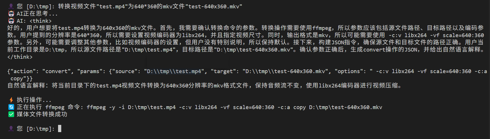

# Smart Shell

一个基于大语言模型的智能Shell，支持自然语言指令和Tab键自动补全功能。

## ✨ 主要特性

- 🤖 **AI驱动**: 使用大语言模型理解自然语言指令
- 📁 **智能文件管理**: 支持文件浏览、复制、移动、删除等操作
- 🎬 **媒体处理**: 支持视频、音频文件格式转换
- 🖼️ **图片解读**: 使用AI分析图片中的文字、物体、场景等信息
- ⌨️ **Tab补全**: 智能文件名和路径自动补全
- 📝 **历史记录**: 支持命令历史记录和导航
- 📚 **知识库**: 自动索引文档，提供智能检索和上下文增强
- 🔄 **跨平台**: 支持Windows、Linux、macOS
- 🎯 **双模型支持**: 可配置不同模型用于普通任务和图像处理
- 📎 **Agent Skills**: 在 `config.json` 所在目录的 `skills/` 下按 [Anthropic Agent Skills](https://github.com/anthropics/skills/blob/main/README.md) 放置 `SKILL.md`，启动时加载并注入系统提示

## 🚀 快速开始

### 环境要求

- Python 3.8+（**知识库功能**建议使用 Python 3.12 或 3.13；Python 3.14 下 ChromaDB 存在兼容性问题，主程序可运行但知识库不可用）
- 网络连接（用于AI模型调用）
- Ollama（安装 nomic-embed-text 模型用于知识库向量化，可选）

### 安装依赖

```bash
pip install -r requirements.txt
```

### 运行程序

```bash
python main.py
```

## ⌨️ Tab键自动补全功能

### Windows版本
- 使用 `prompt_toolkit` 库实现稳定的Tab补全
- 支持文件名和路径智能补全
- 支持历史记录导航（上下箭头键）
- 支持光标移动（左右箭头键）
- 无显示问题，体验流畅

### Unix/Linux/macOS版本
- 使用 `readline` 模块实现Tab补全
- 原生命令行体验

### 使用方法

1. **文件名补全**: 输入文件名开头部分，按Tab键自动补全
2. **路径补全**: 支持相对路径和绝对路径的智能补全
3. **多匹配处理**: 多个匹配项时显示选项列表
4. **历史导航**: 使用上下箭头键浏览历史命令
5. **光标控制**: 使用左右箭头键在输入中移动光标

## 🤖 AI功能

### 知识库功能

Smart Shell 集成了智能知识库系统，可以自动索引和检索文档：

- **自动同步**: 程序启动时自动检测和索引知识库目录中的文档
- **智能检索**: 用户提问时自动从知识库检索相关信息
- **多格式支持**: 支持TXT、PDF、DOCX、MD、CSV、Excel等多种文档格式
- **语义搜索**: 基于向量数据库的语义搜索，理解查询意图
- **实时更新**: 检测文档变化并自动更新索引

#### 使用方法

1. **添加文档**: 将文档放入 `.smartshell/knowledge/` 目录
2. **查看状态**: 使用 `knowledge stats` 查看知识库统计（Windows 交互行：`/knowledge stats`）
3. **手动同步**: 使用 `knowledge sync` 手动同步知识库（Windows：`/knowledge sync`）
4. **搜索内容**: 使用 `knowledge search 查询内容` 搜索知识库（Windows：`/knowledge search …`）

在 **Windows** 下，上述在提示符中输入的内置命令均须加 **`/`** 前缀（与退出、帮助等一致）；见下方「Windows：不经 AI 的内置命令与本机命令」。

#### 自由模式（freedom）

- 使用 `freedom on` / `freedom off` 切换，状态写入 `.smartshell/config.json` 的 `freedom_enabled`。（在 Windows 交互行中请用 `/freedom on`、`/freedom off`。）
- 开启后，对**原本需要 y/n 确认**的操作（移动、删除、`shell`、`script`、Git 写操作），会先调用模型判定是否**可逆**；判定为可逆则自动执行，不可逆或无法解析时仍会让你确认。
- 本会话内通过内置 `script` 命令创建的脚本，若随后用 `shell` 以该文件为主命令执行且**退出码为 0**，程序会尝试**自动删除**该脚本（避免临时文件残留）。若你希望长期保留脚本，请勿依赖此行为或勿用同一会话内的 `shell` 直接跑该文件。

#### 确认提示中的 Always（a）与 `confirm_allowlist.json`

在**未开启自由模式**、且仍出现交互确认时，对 **`shell`** 与 **`script` 落盘** 可输入 **`a` 或 `always`**：表示**仅将当前这一条**记入免确认列表（不是全局放行所有命令）。**例外**：`shell` 执行的是**本会话内**由 `script` 命令刚写入的临时脚本（尚未成功执行后自动删除的路径）时，确认提示**只有 y/n**，不提供 `a`，避免把短命临时脚本记入免确认列表。

- **配置文件**：与 `config.json` 同目录下的 **`confirm_allowlist.json`**（`version` 为 2），包含：
  - `shell_script_paths`：由 shell 解析出的**脚本文件绝对路径**（忽略参数；同一 `.py` / `.ps1` 等仅记一条）。
  - `shell_exe_tokens`：无脚本文件时的**可执行标识**（如 `git`、`dir`，或某 `.exe` 的解析路径；忽略后续参数）。
  - `script_basenames`：当前工作目录落盘脚本文件名（如 `tool.py`），同名再次写入时免确认。
  - 若仍存在旧版 `shell_commands`（整行命令），启动时会读出并**折算**为上述字段，下次保存会写入 v2。
- **`always_confirm reset`**（Windows 交互行：`/always_confirm reset`）会删除该文件并恢复每次询问。

#### Agent Skills

与 [anthropics/skills](https://github.com/anthropics/skills/blob/main/README.md) 约定一致：在 **`config.json` 所在目录** 下创建 `skills/` 子目录，每个技能一个文件夹，内含 **`SKILL.md`**（YAML frontmatter 至少包含 `name`、`description`，下方为 Markdown 正文）。

- **路径示例**：使用项目内配置时为 `.smartshell/skills/my-skill/SKILL.md`；使用用户主目录配置时为 `~/.smartshell/skills/...`。
- **随包脚本**：技能目录下可放置 `scripts/*.py` 等文件；正文中的相对路径相对于该技能文件夹。系统提示会注入 **Skill bundle root** 绝对路径，并列出检测到的脚本，便于在 `shell` 中用完整路径调用（`shell` 在**用户工作目录**执行，不会自动进入技能目录）。
- **行为**：启动时扫描并解析全部技能，将索引、bundle 路径、正文注入系统提示；任务与某技能描述匹配时，模型应优先遵循该技能正文中的说明。

#### Windows：不经 AI 的内置命令与本机命令

- 在提示符下，**所有**不经 AI、由程序直接处理的输入（含退出、帮助、清屏、清空上下文、知识库、自由模式、以及本机 shell）均须以 **`/`** 开头，例如 `/exit`、`/help`、`/clear screen`、`/clear context`、`/knowledge on`、`/dir`、`/git status`。
- 未加 `/` 的输入一律作为自然语言交给 AI。**例外**：盘符切换（如 `d:`）仍可直接输入，无需 `/`。
- Linux / macOS 下：内置命令与常见系统命令仍可**不加** `/` 直接输入（避免与绝对路径 `/usr/...` 冲突）。

### 图片解读功能

支持分析各种格式的图片文件，包括：
- **支持格式**: JPG, JPEG, PNG, GIF, BMP, WebP, TIFF
- **分析内容**: 物体识别、场景描述、文字识别、颜色分析、构图特点
- **使用方式**: `分析图片文件名` 或 `解读这张图片的内容`

### 支持的操作

- **文件浏览**: `列出当前目录的文件`
- **文件操作**: `复制文件A到目录B`、`删除文件C`
- **目录操作**: `切换到目录D`、`创建新目录E`
- **媒体处理**: `将视频转换为MP4格式`
- **图片解读**: `分析这张图片的内容`、`识别图片中的文字`
- **信息查询**: `显示文件详细信息`

### 示例指令

```
🤖 [当前目录]: 列出所有Python文件
🤖 [当前目录]: 复制main.py到backup文件夹
🤖 [当前目录]: 将video.avi转换为MP4格式
🤖 [当前目录]: 分析这张图片的内容
🤖 [当前目录]: 切换到上级目录
🤖 [当前目录]: 创建一个名为测试文件夹的目录
🤖 [当前目录]: 分析这张图片中的文字内容
```

## 📁 项目结构

```
smart-shell/
├── main.py                        # 主程序入口
├── skills/                        # 内建 Agent Skills
├── .smartshell                    # 配置目录
|   ├── config.json                # 配置文件
|   ├── knowledge/                 # 知识库文档目录
|   ├── skills/                    # 外部 Agent Skills（可选；优先级高于内建 skills/）
|   ├── workspace/                 # 历史/辅助目录（可选）；`script` 落盘已改为当前工作目录
|   └── knowledge_db/              # 知识库数据库（自动生成）
├── agent/                         # AI代理模块
│   ├── smart_shell_agent.py       # Smart Shell AI代理
│   ├── skills_loader.py           # Agent Skills 加载（SKILL.md）
│   ├── knowledge_manager.py       # 知识库管理器
│   ├── history_manager.py         # 历史记录管理器
│   ├── windows_input.py           # Windows输入处理器
│   └── tab_completer.py           # Unix系统Tab补全
├── demo/                          # 演示文件
└── README.md                      # 项目说明
```

## 🔧 配置
- 必须配置normal_model
- 可选配置vision_model以支持图片解析

创建 `.smartshell/config.json` 配置文件，支持为不同任务配置不同的AI模型：

```json
{
  "normal_model": {
    "provider": "openwebui",
    "params": {
      "api_key": "your_api_key",
      "base_url": "https://your-api-url.com/api",
      "model": "Qwen3-235B-A22B"
    }
  },
  "vision_model": {
    "provider": "ollama",
    "params": {
      "model": "qwen2.5vl:7b"
    }
  }
}
```

**配置说明**:
- `normal_model`: 用于普通任务的模型（如文件操作、目录浏览等）
- `vision_model`: 用于图像处理的视觉模型（需要支持视觉功能）
- `provider`: 支持 `ollama`、`openai`、`openwebui`
- `params`: 包含API密钥、基础URL和模型名称

### 媒体处理配置

确保已安装ffmpeg并配置PATH环境变量：

```bash
# Windows
# 下载ffmpeg并添加到PATH

# Linux/macOS
sudo apt install ffmpeg  # Ubuntu/Debian
brew install ffmpeg      # macOS
```

## 🐛 故障排除

### 模型配置问题

- 确保配置文件格式正确（JSON格式）
- 检查API密钥和URL是否正确
- 对于Ollama模型，确保模型已下载并可用

### 知识库问题

- 确保已安装知识库相关依赖：`pip install chromadb langchain langchain-experimental sentence-transformers`
- 对于知识库向量化，需要安装并运行Ollama服务
- 确保知识库目录 `.smartshell/knowledge/` 存在且有读取权限
- 如果知识库初始化失败，程序会继续运行但不会使用知识库功能

## 演示效果



## 🤝 贡献

欢迎提交Issue和Pull Request！

## 📄 许可证

MIT License