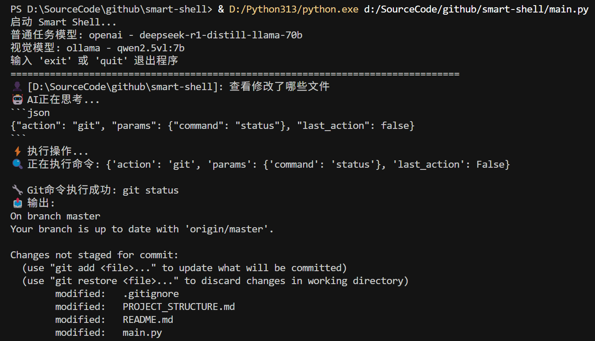

# Code Wood

Code Wood is a terminal-based coding assistant.

## Highlights

- Natural language command handling powered by configurable model providers
- Automatic loading of Agent Skills from the `skills/` directory
- Unified model provider configuration with per-model settings
- Built-in MCP support, including resource loading, batch tool calls, and OAuth 2.0 for URL-based servers
- Execution policies and confirmation guardrails for safer automation

## Quick Start

### Requirements

- Python 3.8+
- Network access for AI model calls

### Install Dependencies

```bash
pip install -r requirements.txt
```

### Run the App

```bash
python cli/main.py

# Start with a specific workspace by name or path
python cli/main.py --workspace <workspace name or path>
python cli/main.py -w <workspace name or path>

# Run one task and exit
python cli/main.py exec "your task request"

# Start with a workspace and run one task before exiting
python cli/main.py --workspace <workspace name or path> exec "your task request"

# Choose a model at startup
python cli/main.py --model <model name>
python cli/main.py -m <model name>
```

## Desktop GUI

Code Wood ships a desktop GUI under `desktop/`. The terminal UI and the
GUI share the **same entry point and the same executable**: run Code Wood
normally for the terminal UI, or pass the `app` command to open the GUI.
The GUI renders a TypeScript (React) UI inside the platform's default web
engine (WebView2 on Windows) via
[pywebview](https://pywebview.flowspace.dev/), and drives the existing
agent through a headless backend "serve" mode over a localhost HTTP +
Server-Sent-Events API.

Features: AI chat with streaming output, all `/workspace` and `/chat`
commands, light/dark themes, English / Simplified Chinese localization,
and a settings screen (theme, language, model, execution policy).

### Launch the GUI

```bash
# Development
python cli/main.py app

# Packaged build
codewood app
```

Launching `app` opens the desktop window without a console window. In a
packaged build, `codewood app` starts the GUI in a detached process and
returns control to the command prompt immediately. The GUI process spawns
the backend by re-launching the same executable in `serve` mode
(development: `python cli/main.py serve`).

The packaged build is a single **one-dir folder** (`dist/codewood/`) holding
**two executables** plus a shared `_internal/` runtime:

- **`codewood.exe`** — the full console build. It contains *all* terminal-UI
  and GUI functionality.
  - No arguments in a terminal → terminal UI.
  - `codewood.exe app` → desktop GUI from anywhere.
  - Double-click → desktop GUI (a console may briefly flash because this is a
    console-subsystem binary).
- **`codewood-gui.exe`** — a tiny windowed launcher next to `codewood.exe`.
  Double-clicking it opens the GUI **with no console window at all**; it simply
  runs `codewood app` (the sibling `codewood.exe`) in a window-free process. It
  bundles only the Python standard library, so it stays small. For the cleanest
  GUI launch, use this executable (or a shortcut to it).

On non-Windows platforms the same folder with two binaries is produced
(`codewood` and `codewood-gui`).

The build uses PyInstaller **one-dir** mode rather than one-file: a one-file
binary self-extracts through a bootloader process, so every launch costs an
extra resident process. With one-dir each executable runs as a single process,
so the desktop GUI uses **two** processes (the GUI host + the `serve` backend)
and the terminal UI uses **one**.

### Architecture

- The GUI process launches a backend process and talks to it over
  `127.0.0.1` using a per-launch bearer token.
- The backend `serve` mode reuses the normal agent loop, so every GUI
  action maps to the same logic the terminal uses.

### Backend serve mode

```bash
# Headless server for the GUI (ephemeral port by default).
python cli/main.py serve
python cli/main.py serve --host 127.0.0.1 --port 8765
```

On startup it prints a single JSON handshake line
(`{"port": ..., "token": ...}`) on stdout that the GUI reads to connect.

### Develop the GUI

```bash
# 1. Install dependencies (includes pywebview for the GUI)
pip install -r requirements.txt

# 2. Install and build the frontend (or run the Vite dev server)
cd desktop/frontend
npm install
npm run build           # produces desktop/frontend/dist used by the host

# 3. Launch the GUI
cd ../..
python cli/main.py app
```

For live frontend development, run `npm run dev` in `desktop/frontend`
and point the host at it with the `CODEWOOD_GUI_URL` environment
variable (for example `http://localhost:5173`) before launching
`python cli/main.py app`.

### Package

The GUI is bundled by the standard build scripts (the frontend is built
automatically). A single run produces the `dist/codewood/` folder containing
both `codewood` and `codewood-gui`:

```bash
# Windows
build\pack.bat

# Linux/macOS
bash build/pack.sh
```

`codewood` runs the terminal UI by default and the desktop GUI when invoked
as `codewood app`. `codewood-gui` is a thin windowed launcher that opens the
GUI without a console window by delegating to `codewood app`. Ship the whole
`dist/codewood/` folder (the executables need the sibling `_internal/`).

## AI Features

### Execution Policy

Use `execution_policy` in `.codewood/config.jsonc` to control how potentially risky actions are handled:

- `confirmation`: ask for y/n confirmation for every action that needs approval
- `moderate`: automatically execute safe actions after evaluating risk
- `unlimited`: skip safety checks and execute directly

Switch policies with:

```bash
/execution-policy <unlimited|moderate|confirmation>
```

Temporary scripts created through the built-in `script` command are considered session-local work items. If you later run that script through `shell` and it exits with code `0`, Code Wood will attempt to delete it automatically so temporary files do not linger. If you want to keep a script permanently, use `text_file` to create it in the current working directory instead.

### Always-Confirm and `confirm_allowlist.json`

When free mode is disabled and interactive confirmation is still required, the prompt offers `a` or `always` only for `shell` commands. That means only the current command is added to the allowlist (`shell_script_paths` / `shell_exe_tokens`), not every command globally.

- `script` output files and `text_file` writes remain y/n only
- `shell` execution of a script created in the same session also remains y/n only
- The allowlist file lives next to `config.jsonc` as `confirm_allowlist.json`
- Legacy `shell_commands` entries are converted into the newer v2 structure automatically at startup
- `/always_confirm reset` deletes the file and restores the default prompt behavior

### Agent Skills

Code Wood follows the same layout as [Anthropic Agent Skills](https://github.com/anthropics/skills/blob/main/README.md). Create a `skills/` directory and place one skill per folder containing a `SKILL.md` file with YAML frontmatter and Markdown body.

#### Load Paths & Priority

Skills are loaded from five sources, merged by folder name (`skill_id`) from **lowest to highest** priority (higher-priority sources override lower-priority ones with the same name):

| Priority | Source | Path | Description |
|---|---|---|---|
| 1 (lowest) | Built-in | `<project_root>/skills/` | Shipped with the application |
| 2 | Agents external | `~/.agents/skills/` | System-wide agent skills (e.g. from Cursor/Codex) |
| 3 | Global external | `~/.codewood/skills/` | User-level configuration skills |
| 4 | Workspace agents | `<workspace>/.agents/skills/` | Workspace-local agent skills |
| 5 (highest) | Workspace external | `<workspace>/.codewood/skills/` | Workspace-local project skills |

> **Note:** In a standard setup, `<workspace>/` refers to the workspace root directory. The global config directory (`~/.codewood/`) is at `~/.config/codewood/` by default, or overridden via the `CODEWOOD_HOME` environment variable.

Example: if both `~/.agents/skills/my-skill/SKILL.md` and `~/.codewood/skills/my-skill/SKILL.md` exist, the latter takes precedence.

#### Enabling / Disabling Skills

In the GUI, open **Settings → Skills** to see all non-workspace skills grouped by source. Each skill can be toggled on or off independently. Disabled skills are persisted in `skills.jsonc`:

- Built-in, agents, and global skills → `~/.config/codewood/skills.jsonc`
- Workspace skills → `<workspace>/.codewood/skills.jsonc`

```jsonc
{
  "disabledSkills": ["my-skill", "another-skill"]
}
```

#### Skill Folder Contents

- Skill folders can include helper files such as `scripts/*.py`
- Relative paths in a skill body are resolved from that skill folder
- The runtime injects the absolute skill bundle root and detected scripts into the system prompt
- During startup, Code Wood scans and parses all available skills and uses them when a task matches a skill description

#### Bundled Scripts

Skills may ship executable scripts under a `scripts/` subdirectory (e.g. `scripts/*.py`). When the model is given the skill prompt, Code Wood detects these files and lists their absolute paths so the model can invoke them directly via `shell` without guessing the OS-specific location.

### Sub-agents

Sub-agents are user-configured helpers that run an isolated nested agentic loop with their own model, system instructions, and tool allowlist. The main model invokes a sub-agent automatically through a single `run_subagent` tool, based on each sub-agent's `description`, and the sub-agent's final text result is injected back into the main loop.

Define sub-agents as Markdown files with YAML frontmatter, one per file:

- User-level sub-agents live under `~/.codewood/subagents/<name>.md`
- Workspace sub-agents live under `<workspace>/.codewood/subagents/<name>.md` (workspace overrides user-level by `name`)

Frontmatter keys (the Markdown body is the sub-agent's independent system instructions):

- `name` (required) — sub-agent id
- `description` (required) — when-to-use text that drives the main model's auto-selection
- `model` (optional) — a `provider/model` selector referencing `model_providers`; defaults to the main model
- `tools` (optional) — allowlist of tool names; defaults to a core coding set (`shell`, `apply_patch`, `read`, `project_context_search`, `update_plan`, `request_skill_prompt`). An explicit empty list (`tools: []`) grants no tools. `run_subagent` is always excluded, so sub-agents cannot nest.
- `max_rounds` (optional) — maximum tool-use rounds before the sub-agent must return (default 20)

The `run_subagent` tool also accepts an optional `image` argument (a file path). The image is attached to and analyzed by the **sub-agent's own model**, not the main model — so a non-multimodal main model can delegate image understanding to a multimodal sub-agent. See `additional-subagents/image-analyzer.md` for a ready-made example that turns a UI mockup, screenshot, diagram, or chart into a structured description a coding model can act on.

### Built-In Commands vs Native Shell Commands

- Built-in commands that do not go through AI must start with `/`, for example `/exit`, `/help`, `/clear screen`, `/clear context`, and `/free`
- Native shell commands or scripts that should run directly must start with `!`, for example `!dir` or `!git status`
- Any input that does not start with `/` is treated as natural language and sent to the AI

## Project Structure

```text
codewood/
├── cli/                           # Core application code
├── cli/server/                    # Headless serve mode (HTTP + SSE) for the GUI
├── cli/tests/                     # Test suite
├── desktop/                       # Desktop GUI (TypeScript UI + pywebview host)
│   ├── frontend/                  # Vite + React + TypeScript UI
│   └── host/                      # pywebview host (launched via "codewood app");
│                                  #   launcher.py builds the thin codewood-gui
├── skills/                        # Built-in Agent Skills
├── additional-skills/             # Extra skills; copy them into .codewood/skills if needed
├── additional-subagents/          # Example sub-agents; copy them into .codewood/subagents if needed
├── docs/                          # Design and reference documentation
├── demo/                          # Demo assets
├── requirements.txt               # Python dependencies
├── bin/
|   ├── codewood.bat               # Windows launch script
|   └── codewood.sh                # Bash launch script
└── README.md                      # Project documentation
```

## Configuration

`model_providers` is required.

Create `.codewood/config.jsonc` in your user directory:

```json
{
  "model_providers": [
    {
      "provider": "openai",
      "params": {
        "api_key": "YOUR_API_KEY",
        "base_url": "YOUR API BASE URL",
        "api_mode": "auto",
        "include_thinking_in_messages": false,
        "models": [
          {
            "name": "gpt-oss-120b",
            "context_window": "128K",
            "streaming": true,
            "use_clean_content": false,
            "multimodal": false
          },
          { "name": "gpt-4o-mini", "context_window": 64000, "streaming": false }
        ]
      }
    },
    {
      "provider": "ollama",
      "params": {
        "api_mode": "ollama",
        "port": 11434,
        "models": [
          { "name": "qwen2.5vl:3b", "context_window": "96k", "streaming": true }
        ]
      }
    }
  ],
  "execution_policy": "moderate",
  "project_context_first_round_evidence": true,
  "auto_compact_trigger_percent": 60,
  "max_tool_rounds": 30,
  "memory_enabled": false
}
```

### Configuration Notes

- `model_providers`: ordered list of model providers; Code Wood uses the first provider by default
- `model_providers[i].provider`: free-form label used only as the model selector prefix (e.g. `openai/gpt-4o`, `ollama/qwen2.5vl:3b`); it does NOT participate in API-call dispatch — that is decided by `api_mode`
- `model_providers[i].params.api_mode`: selects the API call method
  - `auto` (default): OpenAI-compatible HTTP API; auto-probes `/chat/completions` and `/responses` based on `base_url` suffix
  - `chat`: OpenAI-compatible HTTP API; forces `/chat/completions`
  - `responses`: OpenAI-compatible HTTP API; forces `/responses`
  - `ollama`: local Ollama HTTP API (uses `port`; ignores `api_key`/`base_url`)
  - For backward compatibility, configurations that omit `api_mode` and set `provider: "ollama"` are still treated as `api_mode: "ollama"`
- `model_providers[i].params.include_thinking_in_messages`: provider-level toggle for replaying prior assistant `thinking` / `reasoning_content` back to the API on later requests. Default is usually `false`, but some providers such as DeepSeek benefit from enabling it for better cache hit rates
- `model_providers[i].params.port`: used by `api_mode: "ollama"`, with a default of `11434`
- `model_providers[i].params.models`: model list; the first model is used by default
  - String form: `"gpt-oss-120b"` uses the default `context_window=128000` and `streaming=true`
  - Object form: `{"name":"gpt-oss-120b","context_window":"128K","streaming":true,"use_clean_content":false,"multimodal":false,"extra_headers":{"X-Model":"gpt-oss-120b"}}`
- `context_window`: accepts a positive integer or a string matching `^\d+[kKmM]?$`; invalid values fall back to `128000`
- When `context_window < 64000`, Code Wood skips system prompts, tool prompts, skill prompts, memory, and operational context, and only sends conversation history plus the current user input
- `streaming`: per-model streaming toggle, default `true`
- `use_clean_content`: per-model history-cleaning toggle, default `false`. When enabled, Code Wood prefers stored `_clean_content` over raw assistant `content` when replaying prior history to the model
- `multimodal`: per-model image-input capability, default `true`. When set to `false`, Code Wood hides image-input capability from the `read` tool. To still analyze images, delegate to a multimodal sub-agent via `run_subagent`'s `image` argument (see `additional-subagents/image-analyzer.md`)
- `extra_headers`: per-model custom request headers, available only for OpenAI-compatible `api_mode` values (`auto`/`chat`/`responses`)
- `reasoning_effort`: optional per-model list of reasoning-effort levels the model supports (e.g. `["low","medium","high"]`). When set, a level can be selected per chat — in the TUI via `/model reasoning <level>` and in the GUI model menu — and the choice is sent to the provider as `reasoning_effort` (chat API) or `reasoning.effort` (responses API). The selected level is saved per chat and restored on reload. Omit or leave empty to disable reasoning-effort selection for the model. Object-form example: `{"name":"gpt-oss-120b","context_window":"128K","reasoning_effort":["low","medium","high"]}`
- `auto_compact_trigger_percent`: automatic summarization threshold, default `60`
- `model_providers[i].params`: provider-specific parameters such as API keys and base URLs
- All string values in `config.jsonc` support environment variable placeholders of the form `${ENV_NAME}`
- Placeholders are type-converted automatically, including `bool`, `int`, `float`, `null`, and JSON `list` / `dict` values

## MCP Configuration

Code Wood automatically reads `mcp.jsonc` from the same directory as `config.jsonc`:

- If the file exists and is valid, `mcpServers` is loaded and injected into the system prompt
- MCP server tool metadata is preloaded asynchronously in the background so the UI stays responsive
- If the file is missing or invalid, Code Wood keeps running and simply starts with an empty MCP server list
- Store secrets in environment variables instead of committing them in plain text
- MCP connection and retry logs are written to `workspace/logs/mcp_manager.log` rather than the terminal

### Available MCP Actions

- `mcp_list_tools`: list tools for a specific server
- `mcp_list_resources`: list resources for a specific server
- `mcp_read_resource`: read a resource URI
- `mcp__<server>__<tool>`: MCP tools are injected directly into the function-calling tool list with a `mcp__server__toolname` prefix; call them like any native tool
- `mcp_list_prompts`: list prompts for a specific server
- `mcp_get_prompt`: fetch a prompt result by name and parameters
- Failure states are classified as `unsupported`, `missing_dependency`, or `connect_failed`

### OAuth 2.0 for URL-Based MCP Servers

URL transport supports OAuth flows automatically after a `401 Unauthorized` challenge:

- Parses `WWW-Authenticate`, including `resource_metadata` and `scope`
- Discovers Protected Resource Metadata and Authorization Server Metadata
- Uses Authorization Code + PKCE with `S256`
- Saves and loads tokens from `<config_dir>/oauth_tokens.json` and refreshes them when possible
- Attempts Dynamic Client Registration when `client_id` is not configured and the authorization server exposes `registration_endpoint`

Recommended per-server OAuth configuration:

```json
{
  "mcpServers": {
    "secure-url-server": {
      "url": "https://mcp.example.com/mcp",
      "headers": {},
      "oauth": {
        "client_id": "https://app.example.com/oauth/client-metadata.json",
        "client_secret": "",
        "redirect_host": "127.0.0.1",
        "redirect_port": 0,
        "scope": "files:read files:write",
        "open_browser": true
      }
    }
  }
}
```

Notes:

- `redirect_port: 0` means Code Wood will pick a free local callback port automatically
- If `open_browser=false`, the app prints the authorization URL so you can open it manually
- If `scope` is not configured, Code Wood prefers the 401 challenge scope and otherwise falls back to `scopes_supported`

Example `mcp.jsonc`:

```json
{
  "mcpServers": {
    "playwright": {
      "command": "npx",
      "args": ["-y", "@playwright/mcp@latest"]
    },
    "custom-stdio": {
      "command": "python",
      "args": ["-m", "my_mcp_server"],
      "env": {
        "MY_API_BASE": "https://example.com"
      }
    }
  }
}
```

## Troubleshooting

### Model Configuration Issues

- Make sure the configuration file is valid JSON
- Check your API keys and base URLs
- For Ollama models, confirm that the model has been downloaded and is available locally

## Demo



## Contributing

Issues and pull requests are welcome.

## License

MIT License
