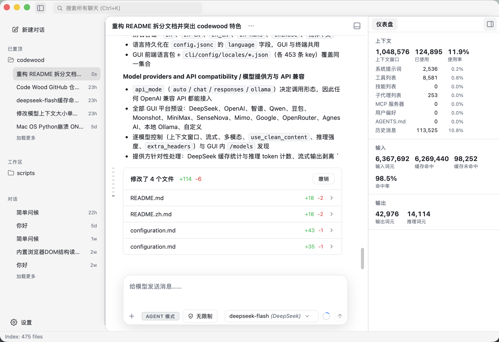
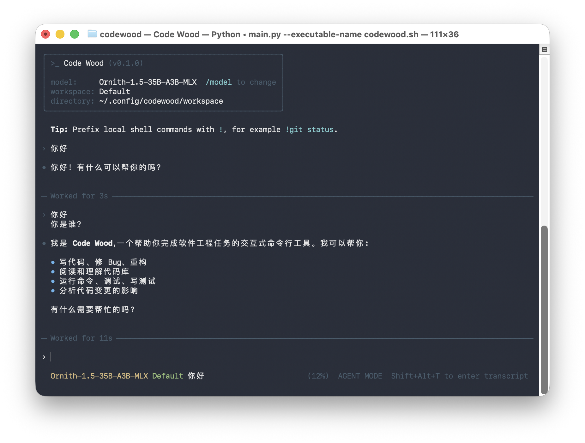

# Code Wood

**English** | [简体中文](README.zh.md)

Code Wood — a desktop AI coding assistant with Agent Skills, MCP tools, and a companion terminal CLI.

## Highlights

### Desktop GUI

- A native desktop app (WebView2 on Windows, WebKit on macOS/Linux) that hosts a React UI and talks to the same agent core the terminal uses
- Streaming chat with a rich composer: markdown rendering, syntax-highlighted code blocks, image attachments, in-place diff previews, and per-round step timelines
- Everything visual and clickable: workspace and chat management, sidebar navigation, global chat search, archived chats, and a status bar with live model/workspace state
- All `/workspace` and `/chat` commands are available as UI actions — no need to memorize slash commands
- Light/dark themes and settings screens for theme, language, models, MCP, skills, sub-agents, tools, and security
- Built-in panels: a **Dashboard** for context/token usage per bucket, an **embedded console** you can watch the agent type into, and a **browser** tab for previewing local HTML or browsing the web
- **Full-text search across every chat**: search the entire history of all conversations (and workspaces) from one search box, then jump straight to the matching message
- **Background image** for the app window, with an adjustable transparency slider so your wallpaper shows through without hurting readability
- One launcher opens the GUI with no console window at all (`codewood-gui`), and the GUI runs as a single extra process next to the backend

### Tools the model can actually drive

- The **built-in terminal is a real, shared console**: the model runs commands through it and reads back the output, so it can compile, run, and debug your programs — and you watch it happen live in the terminal panel
- The **built-in browser** gives the model its own web page: it can open a URL, evaluate JavaScript, and read the DOM/console of the rendered page to debug web code
- **Toggle every tool and skill on or off** from Settings → Tools and Settings → Skills; disabled tools disappear from the schema sent to the model, so they cost no tokens
- **Compact mode** — one click turns off every optional tool for a minimal toolset, and one click restores them

### Multi-language interface

- **English and Simplified Chinese** interfaces, switchable at any time from Settings → General in the GUI or with `/language` in the terminal — no restart needed

### Model providers and API compatibility

- **One configuration for every provider**: `model_providers` is an ordered list, each entry holding an `api_key` / `base_url` / `api_mode` plus a per-model option list
- **`api_mode` picks the call shape**: `chat` forces the OpenAI-compatible `/chat/completions` API, `responses` forces the OpenAI-compatible `/responses` API, `ollama` talks to a local Ollama server, and the default `auto` probes both and adapts
- **Ready-made platform presets** that only need an API key (base URL and API mode are filled in automatically): DeepSeek, OpenAI, 智谱 (Zhipu), Qwen (DashScope), 豆包 (Doubao), 月之暗面 (Moonshot), MiniMax, SenseNova (商汤日日新), Mimo (Xiaomi), Google, OpenRouter, Agnes AI, local **Ollama**, and a fully custom endpoint
- **Any OpenAI-compatible API works**, including self-hosted gateways and local servers, because dispatch is driven by `api_mode` rather than by a hard-coded provider list; per-model `extra_headers` cover gateways that need custom routing headers
- **Per-model control**: context window, streaming on/off, multimodal image input, history-cleaning (`use_clean_content`), reasoning-effort levels, and custom headers
- **Model discovery in the GUI**: pick a platform, paste a key, then refresh to fetch the model list (and context-window values) straight from the provider's `/models` API
- **Provider-specific handling** where it matters — DeepSeek cache-hit/miss accounting, reasoning-token counting, and stripping of hidden `<think>`-style reasoning blocks from streamed output

### Model efficiency and context

- Natural language command handling powered by configurable model providers
- **Extreme prompt-cache optimization**: history is serialized into a byte-stable prefix that only ever grows at the tail, so the provider's prompt-prefix cache keeps hitting — with the DeepSeek API this reaches **99%+ cache hit rates**, cutting both latency and cost
- The **Dashboard** reports cache hits/misses and per-bucket token usage so you can see the savings
- **Agent Skills**: skills are discovered automatically from the `skills/` directory (and four other layers) and injected when a task matches their description

### Project-aware instructions

- **AGENTS.md support**: drop an `AGENTS.md` in a repo and Code Wood injects it as user-defined instructions — no per-tool configuration and no extra files to learn
- Instructions are collected from the global config directory **and** every directory along the path from the repository root down to the current workspace, so a monorepo can define repo-wide rules plus per-package overrides
- An `AGENTS.override.md` placed next to an `AGENTS.md` wins for that directory, letting you keep the committed file and add local-only instructions
- Files are re-read when they change, so editing instructions takes effect without restarting the app
- Explicitly selected skills and explicitly targeted MCP servers take precedence when they conflict with `AGENTS.md`
- **Semantic project code index**: Code Wood builds an incremental BM25 + embedding index of your workspace (kept fresh by a file watcher) and exposes text search plus caller/callee call-graph queries as a tool

### Safety and control

- **AI security review**: risky operations such as script execution and command reversibility are classified by a dedicated, configurable audit model (Settings → Security)
- **Shell sandbox**: run AI-issued commands under an OS-level isolation layer with `read_only`, `workspace_write`, or `full_access` levels, plus an optional network switch (Windows only for now — see [Shell sandbox](docs/en/sandbox.md))
- Execution policies and confirmation guardrails for safer automation, with an editable confirm allowlist
- Built-in MCP support, including resource loading, batch tool calls, and OAuth 2.0 for URL-based servers
- **Sub-agents**: nested agent loops with their own model, instructions, and tool allowlist — including delegating image analysis to a multimodal model
- **Plan mode**: a design-only mode in which the model plans the change instead of executing it

## Quick Start

### Requirements

- Python 3.12+
- Network access for AI model calls

### Install Dependencies

```bash
pip install -r requirements.txt
```

### Run the Desktop GUI

```bash
# Development
python cli/main.py app

# Packaged build
codewood app
```

The GUI needs the frontend bundle. The packaged build already contains it; when
running from source, build it once:

```bash
cd desktop/frontend
npm install
npm run build
```

See [Desktop GUI](docs/en/gui.md) for the full architecture, serve mode, live
frontend development, and packaging details.

### Run the Terminal UI

```bash
python cli/main.py

# Start with a specific workspace by name or path
python cli/main.py --workspace <workspace name or path>
python cli/main.py -w <workspace name or path>

# Run one task and exit
python cli/main.py exec "your task request"

# Start with a workspace and run one task before exiting
python cli/main.py --workspace <workspace name or path> exec "your task request"

# Choose a model at startup
python cli/main.py --model <model name>
python cli/main.py -m <model name>
```

The TUI covers the same agent core as the GUI (chat, workspaces, models, skills,
sub-agents, MCP, plan/agent mode). See [Terminal UI](docs/en/tui.md) for the
command reference and [Built-in commands](docs/en/ai-features.md) for the
`/`-prefixed commands.

## Documentation

| Document | Contents |
|---|---|
| [Desktop GUI](docs/en/gui.md) | GUI architecture, compose and serve mode, development, packaging |
| [Terminal UI](docs/en/tui.md) | TUI entry points and slash-command reference |
| [Configuration](docs/en/configuration.md) | `config.jsonc`, model providers, per-model options |
| [MCP Configuration](docs/en/mcp.md) | `mcp.jsonc`, available MCP actions, OAuth 2.0 |
| [Agent Skills](docs/en/skills.md) | Load paths, priority, enabling/disabling, bundled scripts |
| [Sub-agents](docs/en/subagents.md) | Sub-agent definition, frontmatter, image delegation |
| [AGENTS.md](docs/en/agents-md.md) | Project and global instruction files, override files, precedence |
| [AI Features](docs/en/ai-features.md) | Execution policy, confirm allowlist, built-in vs shell commands |
| [Shell sandbox](docs/en/sandbox.md) | Sandbox levels and platform implementations |
| [Agent Skills architecture](docs/en/skill-architecture.md) | Portable skill design principles |
| [Project structure](docs/en/project-structure.md) | Repository layout |
| [Troubleshooting](docs/en/troubleshooting.md) | Common configuration problems |

## Screenshots

### Desktop GUI



### Terminal UI



## Contributing

Issues and pull requests are welcome.

## License

MIT License
